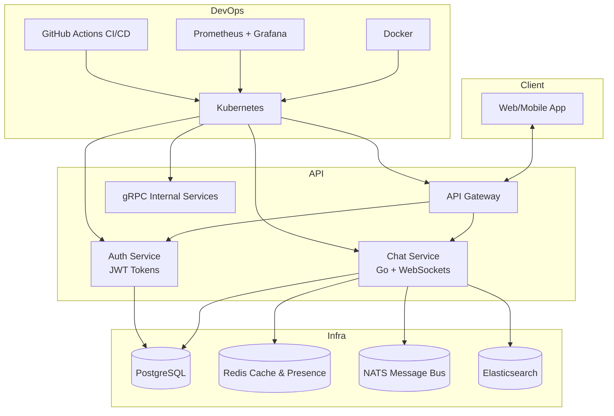

<!-- Top Banner -->

  

  <b>A modern, real-time chat platform built for communities</b>

---

## 🚀 What is Nexus?

Nexus is a **high-performance chat application** designed to bring people together through seamless real-time communication.  
It is built with **scalable, production-grade architecture** inspired by modern messaging systems like Slack and Discord.

### ✨ Highlights

- ⚡ **Real-time messaging** with WebSocket connections
- 🏠 **Server-based communities** with organized channels
- 🔒 **JWT-based authentication** and secure user management
- 📡 **Event-driven architecture** with NATS
- 🔍 **Message search** with Elasticsearch
- 📊 **Monitored & scalable** with Kubernetes, Prometheus, and Grafana

---

## 🛠️ Tech Stack

  

- **Backend:** Go (Golang), Gin, Gorilla WebSocket, gRPC
- **Database:** PostgreSQL (message storage, metadata)
- **Caching & Presence:** Redis (sessions, pub/sub for online status)
- **Messaging Bus:** NATS (event-driven communication)
- **Search:** Elasticsearch (full-text message search)
- **Authentication:** JWT tokens
- **DevOps & Infrastructure:** Docker, Kubernetes, GitHub Actions (CI/CD)
- **Monitoring:** Prometheus + Grafana for metrics, logs, and alerting

---

## 📊 System Architecture

---

## 🤝 Contributing

We welcome contributions! Once the core system reaches stability, we'll provide detailed contribution guidelines.

For now, ⭐ star the repo and watch for updates!

---

## 📄 License

This project is licensed under the MIT License.

<!-- Footer Banner -->

  

